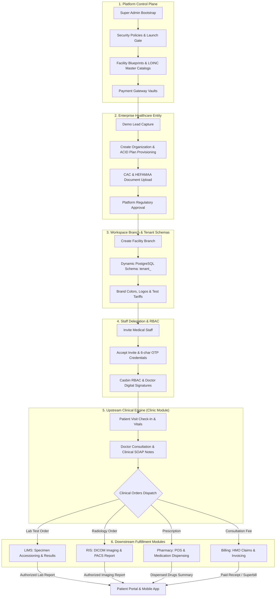

# CUREXAL API SPECIFICATION & ARCHITECTURAL REFERENCE

**Canonical Enterprise Reference Manual — Generated from Active Go/Echo Registrations**

> **Source of Truth**: This document provides an exhaustive, production-grade reference for all **120 registered HTTP endpoints** exposed by the Curexal Platform Kernel (`internal/bootstrap/modules.go`). Every endpoint matches the live Go handler implementations and strictly adheres to the canonical PostgreSQL schema.

---

# Table of Contents

1. [Architecture, Security & Protocol Standards](#1-architecture-security--protocol-standards)
2. [End-to-End Testing Lifecycle & Step-by-Step Execution Order](#2-end-to-end-testing-lifecycle--step-by-step-execution-order)
3. [Phase 1: System Health & Core Gateway Probes (Endpoints 1–2)](#3-phase-1-system-health--core-gateway-probes)
4. [Phase 2: Authentication, Identity & Session Management (Endpoints 3–14)](#4-phase-2-authentication-identity--session-management)
5. [Phase 3: User Self-Service, Credentials & RBAC (Endpoints 15–26)](#5-phase-3-user-self-service-credentials--rbac)
6. [Phase 4: Platform Control Plane, Telemetry & Diagnostics (Endpoints 27–33)](#6-phase-4-platform-control-plane-telemetry--diagnostics)
7. [Phase 5: Facility Blueprints & Dynamic Forms (Endpoints 34–40)](#7-phase-5-facility-blueprints--dynamic-forms)
8. [Phase 6: Master Medical Reference Catalogs (Endpoints 41–46)](#8-phase-6-master-medical-reference-catalogs)
9. [Phase 7: Organization Lifecycle & Onboarding (Endpoints 47–56)](#9-phase-7-organization-lifecycle--onboarding)
10. [Phase 8: Regulatory Verification & Platform Compliance (Endpoints 57–64)](#10-phase-8-regulatory-verification--platform-compliance)
11. [Phase 9: Facility Branches & Workspace Schemas (Endpoints 65–69)](#11-phase-9-facility-branches--workspace-schemas)
12. [Phase 10: Staff Memberships & Casbin RBAC Engine (Endpoints 70–78)](#12-phase-10-staff-memberships--casbin-rbac-engine)
13. [Phase 11: Organization Catalogs & Custom Pricing Tariffs (Endpoints 79–85)](#13-phase-11-organization-catalogs--custom-pricing-tariffs)
14. [Phase 12: Organization Branding & In-App Alerts (Endpoints 86–95)](#14-phase-12-organization-branding--in-app-alerts)
15. [Phase 13: Subscriptions, Commercial Marketplace & Webhooks (Endpoints 96–104)](#15-phase-13-subscriptions-commercial-marketplace--webhooks)
16. [Phase 14: Developer Integrations, API Keys & Webhooks (Endpoints 105–111)](#16-phase-14-developer-integrations-api-keys--webhooks)
17. [Phase 15: Clinical Encounters & Laboratory LIS (Endpoints 112–116)](#17-phase-15-clinical-encounters--laboratory-lis)
18. [Phase 16: Patient Portal Self-Service (Endpoints 117–121)](#18-phase-16-patient-portal-self-service)
19. [Phase 17: Security Audit Logs & Operational Settings (Endpoints 122–127)](#19-phase-17-security-audit-logs--operational-settings)
20. [Appendix: Environment Variables, Casbin Permissions & Capability Catalog](#20-appendix)
21. [Architectural Story: How All Endpoints Connect (Clinic Module First)](#21-architectural-story-how-all-endpoints-connect-clinic-module-first)

---

# 1. Architecture, Security & Protocol Standards

### 1.1 Base URL & Path Routing

All platform endpoints are namespaced under the version 1 API gateway:

```
{{base_url}}/api/v1
```

In a local environment, `{{base_url}}` resolves to `http://localhost:8080`. For tenant-routed workspace requests, the Host header contains the branch subdomain (e.g. `http://everight-ikeja.localhost:8080` or `https://everight-ikeja.curexal.com`).

### 1.2 Unified JSON Response Envelope

All HTTP endpoints return responses structured inside the canonical Curexal envelope:

```json
{
  "data": {},
  "meta": {
    "timestamp": "2026-08-14T12:00:00Z",
    "version": "1.0"
  },
  "links": {},
  "errors": []
}
```

### 1.3 Standardized Error Envelope

When an error occurs, the server responds with the corresponding HTTP status code and population of `message` and `errors`:

```json
{
  "data": {},
  "meta": {
    "timestamp": "2026-08-14T12:00:00Z"
  },
  "message": "Invalid request payload",
  "errors": [
    {
      "code": "ValidationError",
      "message": "Field 'email' must be a valid RFC 5322 email address"
    }
  ]
}
```

### 1.4 Triple Authentication Architecture

1. **Cookie Session Authentication**:
   - `curexal_access` / `jwt`: Cryptographically signed JWT access token (`HttpOnly`, `SameSite=Lax`, `Secure`).
   - `curexal_refresh`: High-entropy refresh token stored in `identity.sessions`.
2. **Bearer Token Authentication**:
   - Sent via HTTP Header: `Authorization: Bearer <jwt_access_token>`.
   - Used by native mobile apps, desktop clients, and single-page apps without cookie access.
3. **Developer API Key Authentication**:
   - Sent via HTTP Header: `Authorization: Bearer cx_live_<64_char_secret>`.
   - Authenticated against SHA-256 hash in `organization.api_keys`.

### 1.5 Multi-Tenant Schema Isolation (`search_path`)

The Curexal backend utilizes schema-per-tenant isolation for healthcare workspaces:

- **Control Plane**: Queries canonical global tables (`identity.*`, `organization.*`, `"authorization".*`, `subscription.*`, `platform.*`).
- **Tenant Context**: When routed via branch subdomain (e.g., `everight-lekki.curexal.com`) or header (`X-Tenant-ID`), middleware sets PostgreSQL `search_path TO tenant_<slug>, public` ensuring zero data leakage across healthcare providers.

---

# 2. End-to-End Testing Lifecycle & Step-by-Step Execution Order

To thoroughly test the entire platform from zero to production readiness, follow this chronological lifecycle pipeline. Each step depends on the data generated in prior steps.

```
   ┌────────────────────────────────────────────────────────────────────────┐
   │  PHASE 1: System Health & Bootstrap                                    │
   │  1. GET /status (Health Check)                                         │
   │  2. GET /api/v1/platform/diagnostics (Verify DB Pool Connectivity)     │
   │  3. GET /api/v1/platform/launch-gate/status                            │
   └───────────────────────────────────┬────────────────────────────────────┘
                                       │
   ┌───────────────────────────────────▼────────────────────────────────────┐
   │  PHASE 2: Super Admin & Platform Configuration                         │
   │  4. POST /api/v1/auth/sign-in (Super Admin Login)                      │
   │  5. PUT  /api/v1/platform/security-policy (Set Password Rules)         │
   │  6. POST /api/v1/platform/facility-types (Create Facility Blueprints)  │
   │  7. POST /api/v1/platform/catalogs/laboratory (Seed LOINC Tests)       │
   └───────────────────────────────────┬────────────────────────────────────┘
                                       │
   ┌───────────────────────────────────▼────────────────────────────────────┐
   │  PHASE 3: Commercial Healthcare Organization Onboarding                │
   │  8. POST /api/v1/demo-requests (Capture Prospective Lead)              │
   │  9. POST /api/v1/organizations (Provision Organization & Plan)         │
   │  10. POST /api/v1/organizations/:id/documents (Upload CAC Document)    │
   │  11. POST /api/v1/organization/setup/submit-review (Submit for Review) │
   │  12. POST /api/v1/platform/organizations/:id/approve (Admin Approval)  │
   └───────────────────────────────────┬────────────────────────────────────┘
                                       │
   ┌───────────────────────────────────▼────────────────────────────────────┐
   │  PHASE 4: Workspace Branch & Catalog Setup                             │
   │  13. POST /api/v1/organization/branches (Provision Facility Workspace) │
   │  14. PUT  /api/v1/organization/branding (Configure Logos & Colors)     │
   │  15. POST /api/v1/organization/catalogs (Create Diagnostic Test Items) │
   │  16. POST /api/v1/organization/catalogs/:id/branch-prices (Overrides)  │
   └───────────────────────────────────┬────────────────────────────────────┘
                                       │
   ┌───────────────────────────────────▼────────────────────────────────────┐
   │  PHASE 5: Staff Onboarding & RBAC Delegation                           │
   │  17. POST /api/v1/organization/invitations (Invite Doctor & Scientist) │
   │  18. POST /api/v1/auth/accept-invite (Staff Sets Password & Joins)     │
   │  19. POST /api/v1/organization/members/:id/branches (Branch Privileges)│
   │  20. POST /api/v1/users/me/signatures (Doctor Uploads Signature Asset) │
   └───────────────────────────────────┬────────────────────────────────────┘
                                       │
   ┌───────────────────────────────────▼────────────────────────────────────┐
   │  PHASE 6: Patient Portal & Authentication                              │
   │  21. POST /api/v1/auth/sign-up (Patient Registers Account)             │
   │  22. POST /api/v1/auth/verify-email (Enters 6-char Alphanumeric OTP)   │
   │  23. POST /api/v1/auth/sign-in (Patient Authenticates)                 │
   │  24. GET  /api/v1/patient/profile (Inspects Medical Demographics)      │
   └───────────────────────────────────┬────────────────────────────────────┘
                                       │
   ┌───────────────────────────────────▼────────────────────────────────────┐
   │  PHASE 7: Clinical & Diagnostic Laboratory Workflow                    │
   │  25. POST /api/v1/clinical/patient-visits (Receptionist Checks Patient)│
   │  26. POST /api/v1/lims/orders (Doctor Creates Full Blood Count Order)  │
   │  27. POST /api/v1/lims/specimens/accession (Phlebotomist Scans Barcode)│
   │  28. POST /api/v1/lims/results (Lab Scientist Records Test Values)     │
   │  29. POST /api/v1/lims/authorizations (Pathologist Signs & Releases)   │
   │  30. GET  /api/v1/patient/results (Patient Downloads Authorized Report)│
   └───────────────────────────────────┬────────────────────────────────────┘
                                       │
   ┌───────────────────────────────────▼────────────────────────────────────┐
   │  PHASE 8: Commercial Billing & Webhooks                                │
   │  31. GET  /api/v1/organizations/:id/marketplace/catalog (Add-On Modules│
   │  32. POST /api/v1/organizations/:id/marketplace/orders (Create Order)  │
   │  33. POST /api/v1/billing/webhooks/paystack (Simulate HMAC Webhook)    │
   │  34. GET  /api/v1/organizations/:id/capabilities/trace (Verify License)│
   └───────────────────────────────────┬────────────────────────────────────┘
                                       │
   ┌───────────────────────────────────▼────────────────────────────────────┐
   │  PHASE 9: Developer APIs & Audit Verification                          │
   │  35. POST /api/v1/organization/api-keys (Issue cx_live_... Secret)    │
   │  36. POST /api/v1/organization/webhooks (Subscribe to Lab Events)      │
   │  37. GET  /api/v1/audit-logs/tenant (Inspect Compliance Trail)         │
   │  38. POST /api/v1/platform/launch-gate/verify (Final Readiness Gate)   │
   └────────────────────────────────────────────────────────────────────────┘
```

---

# 3. Phase 1: System Health & Core Gateway Probes

### Endpoint #1: Root System Health Probe

- **Method**: `GET`
- **Path**: `/status`
- **Handler**: `statusHandler`
- **Authentication**: None (Public)
- **Domain Behavior**: Checks if the web application socket is listening and serving requests.
- **Curl Command**:

```bash
curl -X GET "http://localhost:8080/status"
```

- **Success Response (200 OK)**:

```json
{
  "data": {
    "status": "healthy",
    "environment": "production",
    "timestamp": "2026-08-14T12:00:00Z"
  },
  "meta": { "version": "1.0" },
  "links": {},
  "errors": []
}
```

---

### Endpoint #2: API Gateway Health Probe

- **Method**: `GET`
- **Path**: `/api/v1/status`
- **Handler**: `statusHandler`
- **Authentication**: None (Public)
- **Domain Behavior**: Verifies the health of the `/api/v1` route prefix.
- **Curl Command**:

```bash
curl -X GET "http://localhost:8080/api/v1/status"
```

- **Success Response (200 OK)**: Same payload as `/status`.

---

# 4. Phase 2: Authentication, Identity & Session Management

### Endpoint #3: User / Super Admin Sign In

- **Method**: `POST`
- **Path**: `/api/v1/auth/sign-in`
- **Handler**: `AuthHandler.SignIn`
- **Authentication**: Public (Rate Limited: 5 attempts / 15 mins)
- **Domain Behavior**: Locates credentials in `identity.credentials`, verifies bcrypt hash, checks `identity.users.email_verified` (issues new 6-character code if false), creates a session in `identity.sessions`, and sets cookies (`curexal_access`, `curexal_refresh`, `jwt`).
- **Database Impact**: Inserts `identity.sessions`, updates `identity.credentials.last_login_at`.
- **Request Body**:

```json
{
  "email": "superadmin@curexal.internal",
  "password": "SuperAdminPassword123!"
}
```

- **Curl Command**:

```bash
curl -X POST "http://localhost:8080/api/v1/auth/sign-in" \
  -H "Content-Type: application/json" \
  -d '{"email":"superadmin@curexal.internal","password":"SuperAdminPassword123!"}' \
  -c cookies.txt
```

- **Success Response (200 OK)**:

```json
{
  "data": {
    "identity": {
      "user": {
        "id": "00000000-0000-0000-0000-000000000001",
        "email": "superadmin@curexal.internal",
        "name": "Platform Super Administrator",
        "emailVerified": true
      },
      "platform": {
        "isPlatformAdmin": true,
        "role": "super_admin"
      },
      "organizations": []
    }
  },
  "meta": { "timestamp": "2026-08-14T12:00:00Z" },
  "links": {},
  "errors": []
}
```

---

### Endpoint #4: Patient Sign Up

- **Method**: `POST`
- **Path**: `/api/v1/auth/sign-up`
- **Handler**: `AuthHandler.SignUp`
- **Authentication**: Public
- **Domain Behavior**: Provisions user in `identity.users`, initializes `patient.patient_profiles`, hashes password into `identity.credentials`, generates a 6-character uppercase alphanumeric code (`crypto.GenerateAlphanumericCode(6)`) in `identity.verification_tokens`, and sends welcome email.
- **Request Body**:

```json
{
  "name": "Chinedu Eze",
  "email": "chinedu.eze@example.com",
  "password": "PatientSecurePassword123!",
  "phone": "+2348012345678"
}
```

- **Success Response (201 Created)**:

```json
{
  "data": {
    "success": true,
    "message": "Account created successfully. Please check your email for your 6-character verification code."
  },
  "meta": { "timestamp": "2026-08-14T12:00:00Z" },
  "links": {},
  "errors": []
}
```

---

### Endpoint #5: Verify Email (Alphanumeric Code)

- **Method**: `POST`
- **Path**: `/api/v1/auth/verify-email`
- **Handler**: `AuthHandler.VerifyEmail`
- **Authentication**: Public
- **Domain Behavior**: Case-insensitively validates the 6-character alphanumeric verification code against `identity.verification_tokens`. On success, marks `identity.users.email_verified = TRUE` and deletes token.
- **Request Body**:

```json
{
  "code": "7K9P2X"
}
```

- **Success Response (200 OK)**:

```json
{
  "data": {
    "success": true,
    "message": "Email verified successfully. You can now sign in."
  },
  "meta": { "timestamp": "2026-08-14T12:00:00Z" },
  "links": {},
  "errors": []
}
```

---

### Endpoint #6: Anti-CSRF Token Issuance

- **Methods**: `GET`, `POST`
- **Path**: `/api/v1/auth/csrf`
- **Handler**: `AuthHandler.GetCSRFToken`
- **Authentication**: Public / Session-bound
- **Domain Behavior**: Returns a 32-byte cryptographic token for the `X-CSRF-Token` header.
- **Success Response (200 OK)**:

```json
{
  "data": {
    "csrfToken": "a3f89e2c418b76df90e32145ac782b19e48c12a890df32e4125b6a7c89f01234"
  },
  "meta": { "timestamp": "2026-08-14T12:00:00Z" },
  "links": {},
  "errors": []
}
```

---

### Endpoint #7: Switch Active Tenant Context

- **Method**: `POST`
- **Path**: `/api/v1/auth/switch-context` (also `/api/v1/context/switch`)
- **Handler**: `AuthHandler.SwitchContext`
- **Authentication**: Required
- **Domain Behavior**: Validates user membership in `organization.organization_memberships`, updates `identity.sessions.active_tenant_id`, and sets `active_tenant_id` cookie.
- **Request Body**:

```json
{
  "context": "workspace",
  "tenantId": "44444444-4444-4444-4444-444444444441"
}
```

- **Success Response (200 OK)**:

```json
{
  "data": {
    "success": true,
    "currentContext": "workspace",
    "tenantId": "44444444-4444-4444-4444-444444444441",
    "message": "Context switched successfully"
  },
  "meta": { "timestamp": "2026-08-14T12:00:00Z" },
  "links": {},
  "errors": []
}
```

---

### Endpoint #8: Super Admin Tenant Impersonation

- **Method**: `POST`
- **Path**: `/api/v1/auth/impersonate`
- **Handler**: `AuthHandler.ImpersonateTenant`
- **Authentication**: Required (`is_platform_admin = TRUE`)
- **Domain Behavior**: Generates an ephemeral session in `identity.sessions` linked to target organization with `impersonator_user_id` logged in audit trail.
- **Request Body**:

```json
{
  "organizationId": "33333333-3333-3333-3333-333333333331",
  "reason": "Resolving customer support ticket #9182"
}
```

- **Success Response (200 OK)**:

```json
{
  "data": {
    "success": true,
    "impersonationToken": "eyJhbGciOiJIUzI1NiIsInR5cCI6IkpXVCJ9...",
    "organization": {
      "id": "33333333-3333-3333-3333-333333333331",
      "name": "Everight Diagnostics"
    }
  },
  "meta": { "timestamp": "2026-08-14T12:00:00Z" },
  "links": {},
  "errors": []
}
```

---

### Endpoint #9: Accept Staff Invitation

- **Method**: `POST`
- **Path**: `/api/v1/auth/accept-invite`
- **Handler**: `InviteHandler.AcceptInvite`
- **Authentication**: Public
- **Domain Behavior**: Validates invitation token from `organization.organization_invitations`, provisions user in `identity.users`, creates credential in `identity.credentials`, and creates active membership in `organization.organization_memberships`.
- **Request Body**:

```json
{
  "token": "inv_78a9c2f1e4b89012",
  "name": "Dr. Florence Nwosu",
  "password": "StaffSecurePassword123!"
}
```

- **Success Response (200 OK)**:

```json
{
  "data": {
    "success": true,
    "message": "Invitation accepted. You can now sign in to your workspace."
  },
  "meta": { "timestamp": "2026-08-14T12:00:00Z" },
  "links": {},
  "errors": []
}
```

---

### Endpoint #10: Request Email Modification

- **Method**: `POST`
- **Path**: `/api/v1/users/me/request-email-change` (also `/api/v1/auth/request-email-change`)
- **Handler**: `AuthHandler.RequestEmailChange`
- **Authentication**: Required
- **Domain Behavior**: Checks `identity.users` for email uniqueness, generates a 6-character code in `identity.verification_tokens` with metadata `{"new_email": "new.email@example.com"}`, and sends an email to the new address.
- **Request Body**:

```json
{
  "newEmail": "doctor.new@everight.com"
}
```

- **Success Response (200 OK)**:

```json
{
  "data": {
    "success": true,
    "message": "Verification code dispatched to your new email address."
  },
  "meta": { "timestamp": "2026-08-14T12:00:00Z" },
  "links": {},
  "errors": []
}
```

---

### Endpoint #11 & #12: Verify Email Modification (`POST`, `GET`)

- **Methods**: `POST`, `GET`
- **Path**: `/api/v1/auth/verify-email-change`
- **Handlers**: `AuthHandler.VerifyEmailChange`, `AuthHandler.VerifyEmailChangeGet`
- **Authentication**: Public
- **Domain Behavior**: Validates code or token against `identity.verification_tokens`, extracts `new_email`, updates `identity.users.email`, and deletes the token.
- **Request Body**:

```json
{
  "code": "8N3PWY"
}
```

- **Success Response (200 OK)**:

```json
{
  "data": {
    "success": true,
    "message": "Email address updated successfully."
  },
  "meta": { "timestamp": "2026-08-14T12:00:00Z" },
  "links": {},
  "errors": []
}
```

---

### Endpoint #13: Sign Out

- **Method**: `POST`
- **Path**: `/api/v1/auth/sign-out`
- **Handler**: `AuthHandler.SignOut`
- **Authentication**: Required
- **Domain Behavior**: Deletes active session row from `identity.sessions` and clears all cookies with `Max-Age: -1`.
- **Success Response (200 OK)**:

```json
{
  "data": {
    "success": true,
    "message": "Signed out successfully"
  },
  "meta": { "timestamp": "2026-08-14T12:00:00Z" },
  "links": {},
  "errors": []
}
```

---

### Endpoint #13a: Request Password Reset

- **Method**: `POST`
- **Path**: `/api/v1/auth/request-password`
- **Handler**: `AuthHandler.RequestPassword`
- **Authentication**: Public
- **Domain Behavior**: Looks up the user by email in `identity.users`, generates a time-limited password reset token stored in `identity.password_reset_tokens` (SHA-256 hashed), and dispatches the reset link to the user's verified email. Always returns 200 to avoid user enumeration.
- **Request Body**:

```json
{
  "email": "owner@everight.com"
}
```

- **Success Response (200 OK)**:

```json
{
  "success": true,
  "message": "If your email is registered, a password reset link has been sent."
}
```

---

### Endpoint #13b: Forgot Password (Alias)

- **Method**: `POST`
- **Path**: `/api/v1/auth/forgot-password`
- **Handler**: `AuthHandler.ForgotPassword` (delegates to `RequestPassword`)
- **Authentication**: Public
- **Domain Behavior**: Identical to `request-password`. Provides a user-friendly alias for the password reset flow.
- **Request Body**:

```json
{
  "email": "owner@everight.com"
}
```

- **Success Response (200 OK)**:

```json
{
  "success": true,
  "message": "If your email is registered, a password reset link has been sent."
}
```

---

### Endpoint #13c: Reset Password (Token Completion)

- **Method**: `POST`
- **Path**: `/api/v1/auth/reset-password`
- **Handler**: `AuthHandler.ResetPassword`
- **Authentication**: Public
- **Domain Behavior**: Validates the SHA-256 hash of the incoming token against `identity.password_reset_tokens`, verifies expiry, hashes the new password with bcrypt, updates `identity.credentials.password_hash`, archives the previous hash in `identity.password_histories`, and marks the token as used.
- **Request Body**:

```json
{
  "token": "a3f89e2c418b76df90e32145ac782b19e48c12a890df32e4125b6a7c89f01234",
  "password": "NewSecurePassword456!"
}
```

- **Success Response (200 OK)**:

```json
{
  "success": true,
  "message": "Password reset successfully. You can now log in."
}
```

---

### Endpoint #13d: Set Password (6-Character Verification Code or Token)

- **Method**: `POST`
- **Path**: `/api/v1/auth/set-password`
- **Handler**: `AuthHandler.SetPassword`
- **Authentication**: Public (Verification code or single-use setup token)
- **Domain Behavior**: Completes initial password setup for invited organization owners and staff. Accepts either a 6-character uppercase alphanumeric verification code (`code`) or a setup token (`token`), hashes the new password with bcrypt, updates `identity.credentials.password_hash`, marks the code as used, and sets `identity.users.email_verified = TRUE`.
- **Request Body (6-Character Code - Recommended)**:

```json
{
  "email": "owner@everight.com",
  "code": "7K9P2X",
  "password": "OwnerSecurePassword123!"
}
```

- **Request Body (Token Fallback)**:

```json
{
  "token": "d4e5f6a7b8c9d0e1f2a3b4c5d6e7f8a9b0c1d2e3f4a5b6c7d8e9f0a1b2c3d4",
  "password": "OwnerSecurePassword123!"
}
```

- **Success Response (200 OK)**:

```json
{
  "success": true,
  "message": "Password has been set successfully. You can now sign in."
}
```

---

### Endpoint #13e: Resend Verification Code

- **Method**: `POST`
- **Path**: `/api/v1/auth/resend-verification`
- **Handler**: `AuthHandler.ResendVerification`
- **Authentication**: Public
- **Domain Behavior**: Generates a fresh 6-character uppercase alphanumeric verification code for the specified email, updates `identity.verification_tokens`, dispatches a verification email via `s.server.Mailer`, and logs the code in the server console for local testing.
- **Request Body**:

```json
{
  "email": "owner@everight.com"
}
```

- **Success Response (200 OK)**:

```json
{
  "success": true,
  "message": "Verification code has been dispatched to your email."
}
```

---

# 5. Phase 3: User Self-Service, Credentials & RBAC

### Endpoint #14: Get Current Principal Details

- **Method**: `GET`
- **Path**: `/api/v1/users/me`
- **Handler**: `UserRoleHandler.GetMe`
- **Authentication**: Required
- **Domain Behavior**: Resolves user details, platform role, organization memberships, active facility branch, and Casbin permissions.
- **Success Response (200 OK)**:

```json
{
  "data": {
    "user": {
      "id": "7767f554-dc69-3993-826d-e69c1545a91f",
      "email": "doctor@everight.com",
      "name": "Dr. Adewale Olumide",
      "emailVerified": true,
      "isPlatformAdmin": false,
      "platformRole": "member"
    },
    "activeTenant": {
      "id": "44444444-4444-4444-4444-444444444441",
      "name": "Everight Ikeja Facility",
      "slug": "everight-ikeja"
    },
    "organizations": [
      {
        "id": "33333333-3333-3333-3333-333333333331",
        "name": "Everight Diagnostics",
        "slug": "everight",
        "role": "clinician"
      }
    ],
    "permissions": [
      "workspace:patient:read",
      "workspace:patient:create",
      "workspace:sample:receive",
      "workspace:result:authorize"
    ]
  },
  "meta": { "timestamp": "2026-08-14T12:00:00Z" },
  "links": {},
  "errors": []
}
```

---

### Endpoint #15 & #16: User Extended Profile (`GET`, `PATCH`)

- **Methods**: `GET`, `PATCH`
- **Path**: `/api/v1/users/me/profile`
- **Handlers**: `UserRoleHandler.GetUserProfile`, `UserRoleHandler.UpdateUserProfile`
- **Authentication**: Required
- **Domain Behavior**: Reads and partially updates `identity.user_profiles` (first name, last name, middle name, phone, bio, avatar, emergency contacts).
- **PATCH Request Body**:

```json
{
  "firstName": "Prince",
  "lastName": "Dimkpa",
  "middleName": "Kinikanwo",
  "phoneNumber": "+2348030001122",
  "emergencyContactName": "Blessing Dimkpa",
  "emergencyContactPhone": "+2348030003344"
}
```

- **Success Response (200 OK)**:

```json
{
  "data": {
    "id": "7767f554-dc69-3993-826d-e69c1545a91f",
    "firstName": "Prince",
    "lastName": "Dimkpa",
    "middleName": "Kinikanwo",
    "phoneNumber": "+2348030001122",
    "emergencyContactName": "Blessing Dimkpa",
    "emergencyContactPhone": "+2348030003344",
    "updatedAt": "2026-08-14T12:00:00Z"
  },
  "meta": { "timestamp": "2026-08-14T12:00:00Z" },
  "links": {},
  "errors": []
}
```

---

### Endpoint #17: Change Password (with History Checks)

- **Method**: `PUT`
- **Path**: `/api/v1/users/me/password`
- **Handler**: `UserRoleHandler.ChangePassword`
- **Authentication**: Required
- **Domain Behavior**: Validates current password against `identity.credentials`, checks `identity.password_histories` to prevent reuse, computes new bcrypt hash, archives previous hash, updates active credential, and terminates other active sessions in `identity.sessions`.
- **Request Body**:

```json
{
  "currentPassword": "OldPassword123!",
  "newPassword": "NewSecurePassword456!"
}
```

- **Success Response (200 OK)**:

```json
{
  "data": {
    "success": true,
    "message": "Password changed successfully. All other sessions have been logged out."
  },
  "meta": { "timestamp": "2026-08-14T12:00:00Z" },
  "links": {},
  "errors": []
}
```

---

### Endpoint #18 & #19: Staff Employment History (`GET`, `PUT`)

- **Methods**: `GET`, `PUT`
- **Path**: `/api/v1/users/me/employment`
- **Handlers**: `UserRoleHandler.GetTenantEmployment`, `UserRoleHandler.UpdateTenantEmployment`
- **Authentication**: Required
- **Domain Behavior**: Manages employment records in `identity.user_employments` (employee ID, department, designation, branch, start date).

---

### Endpoint #20 & #21: Professional Clinical Profiles (`GET`, `POST`)

- **Methods**: `GET`, `POST`
- **Path**: `/api/v1/users/me/professional`
- **Handlers**: `UserRoleHandler.GetProfessionalProfiles`, `UserRoleHandler.CreateProfessionalProfile`
- **Authentication**: Required
- **Domain Behavior**: Manages clinical licensing credentials in `identity.user_professional_profiles` (MDCN, MLSCN, NMCN license number, specialty, issue date, expiration date, and accreditation status).
- **POST Request Body**:

```json
{
  "licensingBody": "Medical and Dental Council of Nigeria (MDCN)",
  "licenseNumber": "MDCN/2018/48291",
  "specialty": "Chemical Pathology",
  "expiryDate": "2028-12-31"
}
```

---

### Endpoint #22 & #23: Digital Signatures (`GET`, `POST`)

- **Methods**: `GET`, `POST`
- **Path**: `/api/v1/users/me/signatures`
- **Handlers**: `UserRoleHandler.GetSignatures`, `UserRoleHandler.CreateSignature`
- **Authentication**: Required
- **Domain Behavior**: Stores vector/image signatures and cryptographically hashed public keys in `identity.user_signatures` used for digital sign-off of laboratory diagnostic authorizations.

---

### Endpoint #24 & #25: Directory User Listings & System Roles (`GET /users`, `GET /roles`)

- **Methods**: `GET`
- **Paths**: `/api/v1/users`, `/api/v1/roles`
- **Handlers**: `UserRoleHandler.GetUsers`, `UserRoleHandler.GetRoles`
- **Authentication**: Required (Permission: `users:read`)
- **Domain Behavior**: Lists paginated users and system roles within the active workspace.

---

# 6. Phase 4: Platform Control Plane, Telemetry & Diagnostics

### Endpoint #26: Single-Page App Dynamic Bootstrap Engine

- **Method**: `GET`
- **Path**: `/api/v1/bootstrap`
- **Handler**: `BootstrapHandler.GetBootstrap`
- **Authentication**: Required
- **Domain Behavior**: Core SPA hydration engine. Evaluates the user's principal, active organization, active workspace, licensed capabilities from `subscription.organization_entitlements`, effective Casbin permissions from `"authorization".*`, and generates the dynamic navigation tree, topbar actions, dashboard widgets, and UI feature flags without requiring frontend role calculations.
- **Success Response (200 OK)**:

```json
{
  "data": {
    "identity": {
      "id": "7767f554-dc69-3993-826d-e69c1545a91f",
      "email": "doctor@everight.com",
      "displayName": "Dr. Adewale Olumide"
    },
    "organization": {
      "id": "33333333-3333-3333-3333-333333333331",
      "name": "Everight Diagnostics",
      "subscription": "enterprise"
    },
    "workspace": {
      "id": "44444444-4444-4444-4444-444444444441",
      "name": "Ikeja Diagnostic Center",
      "slug": "everight-ikeja"
    },
    "modules": [
      {
        "code": "laboratory",
        "enabled": true,
        "licensed": true,
        "visible": true
      },
      { "code": "clinical", "enabled": true, "licensed": true, "visible": true }
    ],
    "permissions": [
      "workspace:patient:read",
      "workspace:patient:create",
      "workspace:sample:receive",
      "workspace:result:authorize"
    ],
    "navigation": [
      {
        "id": "nav_dashboard",
        "title": "Dashboard",
        "icon": "LayoutDashboard",
        "path": "/workspace/dashboard",
        "order": 1
      },
      {
        "id": "nav_patients",
        "title": "Patients",
        "icon": "Users",
        "path": "/workspace/patients",
        "order": 2
      },
      {
        "id": "nav_lims",
        "title": "Laboratory LIS",
        "icon": "Activity",
        "path": "/workspace/laboratory",
        "order": 3
      }
    ]
  },
  "meta": { "timestamp": "2026-08-14T12:00:00Z" },
  "links": {},
  "errors": []
}
```

---

### Endpoint #27: Live PostgreSQL Pool & Entity Diagnostics

- **Method**: `GET`
- **Path**: `/api/v1/platform/diagnostics`
- **Handler**: `DiagnosticsHandler.GetDiagnostics`
- **Authentication**: Required (`is_platform_admin = TRUE` or `platform_staff`)
- **Domain Behavior**: Queries live PostgreSQL connection pool statistics (`pgxpool.Stat()`), platform-wide aggregates (`organization.organizations`, `organization.facility_branches`, `identity.users`), and active module distribution for Super Admin telemetry.
- **Success Response (200 OK)**:

```json
{
  "data": {
    "status": "healthy",
    "uptimeSeconds": 86400,
    "database": {
      "status": "connected",
      "openConnections": 20,
      "inUse": 3,
      "idle": 17
    },
    "metrics": {
      "totalOrganizations": 14,
      "totalWorkspaces": 42,
      "totalUsers": 310,
      "organizationsGrowth": [
        { "month": "Jan", "count": 8 },
        { "month": "Feb", "count": 14 }
      ],
      "capabilityDistribution": [
        { "code": "laboratory", "name": "Laboratory LIS", "count": 14 },
        { "code": "clinical", "name": "Clinical EMR", "count": 12 }
      ]
    }
  },
  "meta": { "timestamp": "2026-08-14T12:00:00Z" },
  "links": {},
  "errors": []
}
```

---

### Endpoint #28 & #29: Platform General Configuration (`GET`, `PUT`)

- **Methods**: `GET`, `PUT`
- **Path**: `/api/v1/platform/config`
- **Handler**: `PlatformConfigHandler`
- **Authentication**: Required (`platform:admin`)
- **Domain Behavior**: Reads and updates global platform configuration in `platform.general_settings`.

---

### Endpoint #30 & #31: Identity Security Policies (`GET`, `PUT`)

- **Methods**: `GET`, `PUT`
- **Path**: `/api/v1/platform/security-policy`
- **Handler**: `PlatformConfigHandler`
- **Authentication**: Required (`platform:admin`)
- **Domain Behavior**: Configures platform-wide security rules in `platform.identity_security_policies` (minimum password length, MFA requirements, lockout attempt limits).
- **PUT Request Body**:

```json
{
  "minPasswordLength": 10,
  "requireUppercase": true,
  "requireSpecialChar": true,
  "maxFailedLoginAttempts": 5,
  "lockoutDurationMinutes": 15,
  "sessionInactivityTimeoutMinutes": 60
}
```

---

### Endpoint #32, #33, #34: Launch Gate Readiness Audit (`GET /status`, `POST /verify`, `GET /metrics`)

- **Methods**: `GET`, `POST`
- **Paths**:
  - `GET /api/v1/platform/launch-gate/status`
  - `POST /api/v1/platform/launch-gate/verify` (Permission: `platform:launch_gate:execute`)
  - `GET /api/v1/platform/health/metrics`
- **Handler**: `LaunchGateHandler`
- **Authentication**: Required
- **Domain Behavior**: Runs an automated 10-point production readiness audit: database migration alignment, encryption vault integrity, background job workers, email transport connectivity, payment gateway health, and multi-tenant schema isolation.

---

# 7. Phase 5: Facility Blueprints & Dynamic Forms

### Endpoints #35 - #41: Facility Blueprint Management (`/api/v1/platform/facility-types`)

- **Methods**: `GET`, `POST`, `PUT`
- **Paths**:
  - `GET /api/v1/platform/facility-types` (List active blueprints)
  - `POST /api/v1/platform/facility-types` (Create new blueprint)
  - `PUT /api/v1/platform/facility-types/:typeId` (Update blueprint)
  - `GET /api/v1/platform/facility-types/:typeId/form` (Dynamic registration schema)
  - `GET /api/v1/platform/facility-types/:typeId/navigation` (Default menu blueprint)
  - `GET /api/v1/platform/facility-types/:typeId/setup-steps` (Setup wizard configuration)
  - `GET /api/v1/platform/facility-types/:typeId/dashboard` (Default dashboard layout)
- **Handler**: `FacilityConfigHandler`
- **Authentication**: Required
- **Domain Behavior**: Manages medical facility blueprints (e.g. Pathology Lab, Diagnostic Imaging Center, General Hospital). Defines the dynamic JSON registration form schemas, setup wizards, and default workspace navigation menus for newly provisioned branches.
- **POST Request Body**:

```json
{
  "code": "diagnostic_center",
  "name": "Comprehensive Diagnostic Center",
  "description": "Full-service diagnostic center offering pathology and radiology",
  "icon": "Microscope",
  "isSystem": true
}
```

---

# 8. Phase 6: Master Medical Reference Catalogs

### Endpoints #42 - #45: Master Medical Catalogs (`/api/v1/platform/catalogs`)

- **Methods**: `GET`, `POST`, `PUT`
- **Paths**:
  - `GET /api/v1/platform/catalogs/:domain` (Domains: `laboratory`, `radiology`, `pharmacy`, `billing`, `icd10`)
  - `GET /api/v1/platform/catalogs/:domain/search?q=full+blood+count`
  - `POST /api/v1/platform/catalogs/:domain` (Permission: `platform:admin`)
  - `PUT /api/v1/platform/catalogs/:domain/:id` (Permission: `platform:admin`)
- **Handler**: `MasterCatalogHandler`
- **Authentication**: Required
- **Domain Behavior**: Centralized medical master catalog. Healthcare organizations can import standard LOINC lab tests, ICD-10 diagnostic codes, and radiology modalities into their private catalogs.
- **POST Request Body (Laboratory)**:

```json
{
  "code": "FBC-001",
  "name": "Full Blood Count (FBC)",
  "loincNum": "58410-2",
  "category": "Hematology",
  "specimenType": "Whole Blood (EDTA)",
  "tatHours": 2,
  "basePrice": 4500.0
}
```

---

# 9. Phase 7: Organization Lifecycle & Onboarding

### Endpoint #46: List Organizations

- **Method**: `GET`
- **Path**: `/api/v1/organizations`
- **Handler**: `OrganizationHandler.ListOrganizations`
- **Authentication**: Required (Permission: `organization:read`)
- **Domain Behavior**: Returns organizations the authenticated user belongs to (or all organizations if requested by platform staff).

---

### Endpoint #47: Create Healthcare Organization (Invitation-Based Onboarding)

- **Method**: `POST`
- **Path**: `/api/v1/organizations`
- **Handler**: `OrganizationHandler.CreateOrganization`
- **Authentication**: Required
- **Domain Behavior**: Executes a full ACID transaction encompassing 10 steps:
  1. Validates slug uniqueness in `organization.organizations`.
  2. Resolves or provisions owner identity in `identity.users` (with `NULL` password hash in `identity.credentials`).
  3. Validates subscription plan code against `subscription.plans`.
  4. Creates organization record with full profile metadata (address, city, state, LGA, country, phone, email, registration number, license number, tax ID).
  5. Generates a 32-byte cryptographic setup token stored as SHA-256 hash in `identity.password_setup_tokens` with 72-hour expiry.
  6. Creates active subscription in `subscription.subscriptions`.
  7. Creates owner membership in `organization.organization_memberships` (role: `owner`).
  8. Provisions primary workspace in `workspace.workspaces`.
  9. Creates workspace owner membership in `workspace.workspace_memberships`.
  10. Writes `ORGANIZATION_REGISTERED` audit event in `audit.audit_events`.
- **Owner Identity Flow**: The owner receives a single-use invitation link (`/set-password?token=...`) to set their private password. The platform admin **never knows the owner's password**.
- **Request Body**:

```json
{
  "name": "Everight Diagnostics & Clinical Laboratories",
  "slug": "everight",
  "plan": "smart",
  "address": "15 Allen Avenue, Ikeja",
  "city": "Lagos",
  "state": "Lagos",
  "lga": "Ikeja",
  "country": "Nigeria",
  "phone": "+2348012345678",
  "email": "info@everight.com",
  "registrationNumber": "RC-987654",
  "licenseNumber": "LAB/2024/001",
  "taxId": "TIN-00112233",
  "owner": {
    "email": "admin@everight.com",
    "name": "Dr. Chinedu Okafor"
  }
}
```

- **Alternative Owner Fields**: Instead of the `owner` nested object, you can use flat fields `ownerEmail` and `ownerName`. If neither is provided, the owner email defaults to the organization `email` field, or `owner@<slug>.curexal.com`.

- **Success Response (201 Created)**:

```json
{
  "message": "Organization created successfully. An invitation has been sent to the organization owner.",
  "organization": {
    "id": "33333333-3333-3333-3333-333333333331",
    "name": "Everight Diagnostics & Clinical Laboratories",
    "slug": "everight",
    "plan": "smart",
    "status": "pending_verification",
    "address": "15 Allen Avenue, Ikeja",
    "city": "Lagos",
    "state": "Lagos",
    "country": "Nigeria",
    "setupState": "PENDING_REGISTRATION",
    "setupStep": 1,
    "version": 1
  },
  "invitation": {
    "sent": true,
    "email": "admin@everight.com"
  }
}
```

- **Server Log** (setup link for development):

```
INF owner password setup invitation generated email=admin@everight.com org="Everight Diagnostics" setup_link=https://curexal.space/set-password?token=d4e5f6a7...
```

---

### Endpoint #47b: Transfer Organization Ownership

- **Method**: `POST`
- **Path**: `/api/v1/organizations/:id/transfer-ownership`
- **Handler**: `OrganizationHandler.TransferOwnership`
- **Authentication**: Required (Permission: `organization:write`)
- **Domain Behavior**: Executes an ACID transaction:
  1. Verifies organization exists.
  2. Resolves or provisions the new owner identity in `identity.users` (with `NULL` password and a setup token if new).
  3. Finds and demotes the current owner to `admin` role in `organization.organization_memberships`.
  4. Promotes the new owner to `owner` role across organization and all workspace memberships.
  5. Writes `ORGANIZATION_OWNERSHIP_TRANSFERRED` audit event.
- **Request Body**:

```json
{
  "newOwnerEmail": "new.owner@everight.com",
  "newOwnerName": "Dr. Amaka Nwosu",
  "notes": "Ownership transferred as part of acquisition"
}
```

- **Success Response (200 OK)**:

```json
{
  "message": "Organization ownership transferred successfully"
}
```

---

### Endpoint #47c: Resend Owner Setup Invitation

- **Method**: `POST`
- **Path**: `/api/v1/organizations/:id/resend-invite`
- **Handler**: `OrganizationHandler.ResendOwnerInvite`
- **Authentication**: Required (Permission: `organization:write`)
- **Domain Behavior**: Looks up the active owner of the target organization, generates a fresh 6-character verification code, stores it in `identity.verification_tokens`, dispatches a verification email via `s.server.Mailer`, and logs the code to console.
- **Success Response (200 OK)**:

```json
{
  "message": "Owner verification setup code has been resent successfully"
}
```

---

### Endpoints #48 - #51: Organization Profile & Legal Entity Settings (`GET`, `PUT`)

- **Methods**: `GET`, `PUT`
- **Paths**:
  - `GET /api/v1/organizations/:id`, `PUT /api/v1/organizations/:id`
  - `GET /api/v1/organizations/:id/settings`, `PUT /api/v1/organizations/:id/settings` (Permission: `organization:settings:write`)
- **Handler**: `OrganizationHandler`
- **Authentication**: Required
- **Domain Behavior**: Reads and updates legal entity attributes, CAC registration number, Tax Identification Number (TIN), and contact settings.

---

### Endpoints #52 - #55: Compliance Documents & Review Submission

- **Paths**:
  - `POST /api/v1/organizations/:id/documents` (Upload CAC Certificate, HEFAMAA License)
  - `GET /api/v1/organizations/:id/documents` (List compliance documents)
  - `GET /api/v1/organization/profile`, `PUT /api/v1/organization/profile`
  - `POST /api/v1/organization/setup/submit-review` (Submit for platform verification)
- **Handler**: `DocumentHandler`, `OrganizationProfileHandler`
- **Authentication**: Required

---

### Endpoints #56 - #58: Prospective Commercial Leads

- **Paths**:
  - `POST /api/v1/demo-requests` (Public lead capture)
  - `GET /api/v1/demo-requests` (List leads)
  - `PUT /api/v1/demo-requests/:id` (Update lead status)
- **Handler**: `DemoHandler`

---

# 10. Phase 8: Regulatory Verification & Platform Compliance

### Endpoints #59 - #63: Regulatory Verification Workflow

- **Paths**:
  - `GET /api/v1/platform/organizations` (Platform staff organization directory)
  - `POST /api/v1/platform/organizations/:id/verify`
  - `PATCH /api/v1/platform/documents/:docID/review` (Permission: `organization:document:review`)
  - `POST /api/v1/platform/organizations/:id/approve` (Permission: `organization:verify` - activates organization)
  - `POST /api/v1/platform/organizations/:id/reject` (Permission: `organization:verify`)
- **Handler**: `DocumentHandler`, `OrganizationProfileHandler`
- **Authentication**: Required (`platform_staff`)
- **Domain Behavior**: Platform administrators inspect uploaded corporate registration documents (CAC, HEFAMAA, MLSCN license) and approve or reject organizations.

---

# 11. Phase 9: Facility Branches & Workspace Schemas

### Endpoints #64 - #68: Facility Branches CRUD (`/api/v1/organization/branches`)

- **Methods**: `GET`, `POST`, `PUT`, `DELETE`
- **Paths**:
  - `GET /api/v1/organization/branches`
  - `POST /api/v1/organization/branches` (Permission: `organization:branch:create`)
  - `GET /api/v1/organization/branches/:id`
  - `PUT /api/v1/organization/branches/:id` (Permission: `organization:branch:update`)
  - `DELETE /api/v1/organization/branches/:id` (Permission: `organization:branch:deactivate`)
- **Handler**: `FacilityBranchHandler`
- **Authentication**: Required
- **Domain Behavior**: Manages physical locations in `organization.facility_branches`. `POST` checks `subscription.plans.limits.maxBranches` and automatically provisions isolated tenant schemas (`tenant_<slug>`).
- **POST Request Body**:

```json
{
  "facilityTypeId": "11111111-1111-1111-1111-111111111111",
  "code": "branch-lekki",
  "name": "Lekki Phase 1 Diagnostic Center",
  "isHeadquarters": false,
  "phone": "+2348099887766",
  "email": "lekki@everight.com",
  "address": "Plot 12 Admiralty Way, Lekki",
  "city": "Lagos",
  "state": "Lagos",
  "country": "Nigeria"
}
```

- **Success Response (201 Created)**:

```json
{
  "data": {
    "id": "44444444-4444-4444-4444-444444444442",
    "organizationId": "33333333-3333-3333-3333-333333333331",
    "name": "Lekki Phase 1 Diagnostic Center",
    "code": "branch-lekki",
    "slug": "everight-lekki",
    "isActive": true
  },
  "meta": { "timestamp": "2026-08-14T12:00:00Z" },
  "links": {},
  "errors": []
}
```

---

# 12. Phase 10: Staff Memberships & Casbin RBAC Engine

### Endpoints #69 - #75: Staff Invitations & Role Assignments

- **Paths**:
  - `GET /api/v1/organization/members`
  - `POST /api/v1/organization/invitations` (Permission: `users:write` - invite staff)
  - `GET /api/v1/organization/invitations`
  - `DELETE /api/v1/organization/invitations/:id` (Permission: `users:write` - revoke invite)
  - `POST /api/v1/organization/members/:id/branches` (Assign to facility branch)
  - `POST /api/v1/organization/members/:id/departments` (Assign to clinical department)
  - `PUT /api/v1/organization/members/:id/role` (Permission: `users:write` - change role)
- **Handler**: `StaffMembershipHandler`
- **Authentication**: Required
- **POST Request Body (Invitation)**:

```json
{
  "email": "dr.nwosu@everight.com",
  "role": "clinician",
  "roleTitle": "Senior Consultant Pathologist",
  "facilityBranchId": "44444444-4444-4444-4444-444444444441"
}
```

---

### Endpoints #76 & #77: Casbin Authorization Engine (`/api/v1/authorization`)

- **Paths**:
  - `POST /api/v1/authorization/enforce` (Evaluate Casbin policy)
  - `GET /api/v1/authorization/permissions` (Retrieve active permissions list)
- **Handler**: `AuthzHandler`
- **Authentication**: Required
- **POST Request Body (Enforce)**:

```json
{
  "subject": "usr_7767f554",
  "domain": "tenant_everight-ikeja",
  "object": "lims:results",
  "action": "authorize"
}
```

---

# 13. Phase 11: Organization Catalogs & Custom Pricing Tariffs

### Endpoints #78 - #83: Private Medical Catalogs & Tariffs

- **Paths**:
  - `GET /api/v1/organization/catalogs`
  - `POST /api/v1/organization/catalogs` (Permission: `organization:catalog:write`)
  - `GET /api/v1/organization/catalogs/:id`, `PUT /api/v1/organization/catalogs/:id`
  - `POST /api/v1/organization/catalogs/:id/branch-prices` (Set branch-specific price)
  - `GET /api/v1/organization/insurance-providers`, `POST /api/v1/organization/insurance-providers`
- **Handler**: `OrganizationCatalogHandler`
- **Authentication**: Required
- **POST Request Body (Catalog Item)**:

```json
{
  "code": "FBC",
  "name": "Full Blood Count with Differential",
  "category": "Hematology",
  "standardPrice": 5000.0,
  "billingCode": "LAB-HEM-001",
  "tatMinutes": 60
}
```

---

# 14. Phase 12: Organization Branding & In-App Alerts

### Endpoints #84 & #85: Organization Branding (`GET`, `PUT`)

- **Path**: `/api/v1/organization/branding`
- **Handler**: `OrganizationBrandingHandler`
- **Authentication**: Required
- **Domain Behavior**: Manages brand colors, logos, and report header layouts in `organization.organization_brandings`.
- **PUT Request Body**:

```json
{
  "primaryColor": "#0284c7",
  "secondaryColor": "#0f172a",
  "logoUrl": "https://cdn.curexal.space/email/full_logo.png",
  "version": 1
}
```

---

### Endpoints #86 - #96: Notifications & Direct Messaging

- **Paths**:
  - `/api/v1/organization/notifications/configs` & `PUT /api/v1/organization/notifications/configs`
  - `/api/v1/organization/notifications/templates` & `PUT /api/v1/organization/notifications/templates/:key`
  - `GET /api/v1/organization/notifications`, `POST /api/v1/organization/notifications/:id/read`, `POST /api/v1/organization/notifications/read-all`
  - `GET /api/v1/organization/notifications/deliveries`
  - `GET /api/v1/notifications`, `POST /api/v1/notifications/:id/read`, `POST /api/v1/notifications/read-all`, `GET /api/v1/notifications/unread-count`, `POST /api/v1/notifications`, `GET /api/v1/notifications/preferences`, `PUT /api/v1/notifications/preferences`
  - `GET /api/v1/messages`, `POST /api/v1/messages` (Direct staff messaging)
- **Handler**: `NotificationHandler`, `OrganizationBrandingHandler`

---

# 15. Phase 13: Subscriptions, Commercial Marketplace & Webhooks

### Endpoints #97 - #101: Capabilities & Marketplace Orders

- **Paths**:
  - `GET /api/v1/organizations/:id/capabilities`
  - `GET /api/v1/organizations/:id/capabilities/trace`
  - `GET /api/v1/organizations/:id/marketplace/catalog`
  - `POST /api/v1/organizations/:id/marketplace/subscribe` (Permission: `organization:write`)
  - `POST /api/v1/organizations/:id/marketplace/orders` (Initiate checkout order)
- **Handler**: `EntitlementHandler`, `CommercialHandler`
- **Authentication**: Required
- **POST Request Body (Order)**:

```json
{
  "capabilityCode": "radiology.pacs",
  "billingPeriod": "annual",
  "gatewayProvider": "paystack"
}
```

---

### Endpoint #102: Cryptographically Verified Payment Webhook

- **Method**: `POST`
- **Path**: `/api/v1/billing/webhooks/:provider`
- **Handler**: `CommercialHandler.HandlePaymentWebhook`
- **Authentication**: **UNAUTHENTICATED (Root Echo Handler)**
- **Domain Behavior**: Verifies HMAC-SHA512 signature, marks `subscription.commercial_orders.status = 'paid'`, provisions licensed modules in `subscription.organization_entitlements`, and logs audit trail.

---

# 16. Phase 14: Developer Integrations, API Keys & Webhooks

### Endpoints #103 - #107: Developer API Keys & Webhooks

- **Paths**:
  - `GET /api/v1/organization/api-keys`, `POST /api/v1/organization/api-keys`, `DELETE /api/v1/organization/api-keys/:id`
  - `GET /api/v1/organization/webhooks`, `POST /api/v1/organization/webhooks`, `DELETE /api/v1/organization/webhooks/:id`
  - `GET /api/v1/organization/webhooks/deliveries` (Inspect delivery telemetry)
- **Handler**: `OrganizationIntegrationHandler`
- **Authentication**: Required (Permission: `organization:integrations:write`)
- **POST Request Body (API Key)**:

```json
{
  "name": "Roche Cobas 6000 Analyzer Integration",
  "expiresAt": "2027-12-31T23:59:59Z"
}
```

- **Success Response (201 Created)**:

```json
{
  "data": {
    "id": "key_8899aabbccddeeff",
    "name": "Roche Cobas 6000 Analyzer Integration",
    "apiKey": "cx_live_78a9c2f1e4b8901234567890abcdef1234567890abcdef1234567890abcdef12",
    "message": "Store this key safely. It will not be shown again."
  },
  "meta": { "timestamp": "2026-08-14T12:00:00Z" },
  "links": {},
  "errors": []
}
```

---

# 17. Phase 15: Clinical Encounters & Laboratory LIS

### Endpoint #108: Register Patient Clinical Visit

- **Method**: `POST`
- **Path**: `/api/v1/clinical/patient-visits`
- **Handler**: `PatientVisitHandler.RegisterPatientVisit`
- **Capability**: `clinical.basic` (Protected by `middleware.RequireCapability`)
- **Domain Behavior**: Records an outpatient/inpatient visit encounter, captures vitals, symptoms, and queues the patient into the doctor's consultation worklist.
- **Request Body**:

```json
{
  "patientId": "55555555-5555-5555-5555-555555555551",
  "visitType": "outpatient",
  "chiefComplaint": "Persistent high-grade fever and joint pain for 3 days",
  "vitals": {
    "temperature": 38.8,
    "bloodPressure": "125/82",
    "pulseRate": 84,
    "weightKg": 72.5
  }
}
```

---

### Endpoints #109 - #112: Diagnostic Laboratory LIS Workflow

- **Capability**: `laboratory.basic` (Protected by `middleware.RequireCapability`)
- **Handler**: `LimsHandler`
- **Paths**:
  1. `POST /api/v1/lims/orders`: Creates a diagnostic lab test order with billing line items.
  2. `POST /api/v1/lims/specimens/accession`: Scans sample barcode, assigns accession number, and logs specimen temperature/condition.
  3. `POST /api/v1/lims/results`: Enters quantitative/qualitative test parameter results with reference flags (Normal, Low, High, Critical).
  4. `POST /api/v1/lims/authorizations`: Doctor/Pathologist digital authorization and release of diagnostic test reports to patient portal and referring physician.

- **POST Request Body (Enter Results)**:

```json
{
  "orderId": "66666666-6666-6666-6666-666666666661",
  "testCode": "FBC",
  "parameters": [
    {
      "name": "Hemoglobin",
      "value": "14.2",
      "unit": "g/dL",
      "flag": "NORMAL",
      "referenceRange": "13.0 - 17.0"
    },
    {
      "name": "White Blood Cell Count",
      "value": "12.8",
      "unit": "x10^9/L",
      "flag": "HIGH",
      "referenceRange": "4.0 - 11.0"
    },
    {
      "name": "Platelets",
      "value": "240",
      "unit": "x10^9/L",
      "flag": "NORMAL",
      "referenceRange": "150 - 450"
    }
  ],
  "technicianNotes": "Sample processed on Sysmex XN-550. No fibrin clots detected."
}
```

---

# 18. Phase 16: Patient Portal Self-Service

### Endpoints #113 - #117: Patient Portal (`/api/v1/patient`)

- **Methods**: `GET`, `PUT`
- **Protected by**: `middleware.PatientGuard` (Restricts access exclusively to patient principals)
- **Handler**: `PatientHandler`
- **Paths**:
  - `GET /api/v1/patient/profile`, `PUT /api/v1/patient/profile` (Demographics, blood group, allergies)
  - `GET /api/v1/patient/results` (View authorized diagnostic lab reports)
  - `GET /api/v1/patient/orders`
  - `GET /api/v1/patient/appointments`

---

# 19. Phase 17: Security Audit Logs & Operational Settings

### Endpoints #118 - #120: Immutable Security Audit Logs (`/api/v1/audit-logs`)

- **Methods**: `GET`
- **Paths**:
  - `GET /api/v1/audit-logs/platform` (Permission: `audit:read` - platform-wide audit trail)
  - `GET /api/v1/audit-logs/tenant` (Permission: `audit:read` - workspace-scoped audit events)
  - `GET /api/v1/audit-logs/stats`
- **Handler**: `AuditHandler`

---

### Endpoints #121 - #123: Branch Workspace Operational Settings (`/api/v1/settings/branch`)

- **Methods**: `GET`, `PUT`, `POST`
- **Paths**:
  - `GET /api/v1/settings/branch` (Full branch configuration dictionary)
  - `PUT /api/v1/settings/branch/:section` (Update specific section: `general`, `clinical`, `laboratory`, `billing`, `inventory`)
  - `POST /api/v1/settings/branch/reset` (Reset branch settings to facility blueprint defaults)
- **Handler**: `SettingsHandler`

---

# 20. Appendix

### Casbin Permissions Catalog

| Permission Code                  | Description                                       |
| -------------------------------- | ------------------------------------------------- |
| `organization:read`              | View organization profiles and metadata           |
| `organization:write`             | Modify organization profile and settings          |
| `organization:settings:write`    | Manage CAC, TIN, and legal entity configs         |
| `organization:document:upload`   | Upload regulatory and accreditation documents     |
| `organization:document:review`   | Platform staff document review                    |
| `organization:verify`            | Platform staff organization approval/rejection    |
| `organization:branch:create`     | Provision new facility branch workspaces          |
| `organization:branch:update`     | Modify branch facility configuration              |
| `organization:branch:deactivate` | Deactivate facility branch                        |
| `users:read`                     | View staff member lists and profiles              |
| `users:write`                    | Invite staff, assign roles, branches, departments |
| `audit:read`                     | View security and compliance audit trails         |
| `platform:admin`                 | Full platform administrative privileges           |
| `platform:launch_gate:execute`   | Run automated production readiness audits         |

### Module Capability Catalog

| Capability Code      | Module Name                            | Required License  |
| -------------------- | -------------------------------------- | ----------------- |
| `laboratory.basic`   | Laboratory LIS Accessioning & Orders   | Standard Tier     |
| `clinical.basic`     | Clinical EMR Patient Encounters        | Standard Tier     |
| `radiology.pacs`     | DICOM Imaging & PACS Integration       | Enterprise Add-On |
| `pharmacy.pos`       | Pharmacy POS & Prescription Dispensing | Enterprise Add-On |
| `inventory.advanced` | Multi-Warehouse Stock & Reagents       | Enterprise Add-On |
| `billing.insurance`  | Automated HMO Claims & Tariffs         | Enterprise Add-On |

---

# 21. Architectural Story: How All Endpoints Connect (Clinic Module First)

### 21.1 The Grand Architectural Narrative: From Platform Genesis to Living Clinic

To understand how Curexal works in production, we must view the 113+ endpoints not as isolated URLs, but as **the nervous system of a living healthcare operating system**. 

The system builds up in five distinct architectural chapters:



---

### 21.2 Act 1: The Platform Control Plane (Genesis)
Before any hospital can register, Curexal establishes its foundational control plane:
1. **Super Admin Setup (`/api/v1/auth/sign-in`, `/api/v1/platform/diagnostics`)**: The platform administrator logs into the global control plane and inspects database connection pool health.
2. **Security Policies (`/api/v1/platform/security-policy`)**: Enforces strict password complexity, session TTLs, and brute-force lockout rules across all future tenants.
3. **Medical Master Catalogs (`/api/v1/platform/catalogs`)**: The platform seeds international medical reference data: LOINC laboratory test dictionaries, ICD-10 diagnostic codes, standard radiology modalities, and drug formularies.
4. **Facility Blueprints (`/api/v1/platform/facility-types`)**: Defines the structural blueprints for healthcare facilities (e.g. *Diagnostic Center*, *Standalone Laboratory*, *Multi-Specialty Hospital*), which determine dynamic UI forms, setup wizards, and default menu navigation trees.

---

### 21.3 Act 2: Enterprise Healthcare Organization Onboarding
A diagnostic group or hospital enterprise (e.g., *Everight Diagnostics*) discovers Curexal and registers:
1. **Demo Lead (`POST /api/v1/demo-requests`)**: The hospital submits their initial inquiry.
2. **Atomic Entity Creation (`POST /api/v1/organizations`)**: An ACID transaction executes in PostgreSQL:
   - Creates the enterprise entity in `organization.organizations`.
   - Provisions default subscription limits in `subscription.plans`.
   - Creates the owner membership in `organization.organization_memberships`.
   - Provisions the primary headquarters branch in `organization.facility_branches`.
3. **Regulatory Verification (`POST /api/v1/organizations/:id/documents`, `POST /api/v1/platform/organizations/:id/approve`)**: The hospital uploads their Corporate Affairs Commission (CAC) certificate and HEFAMAA medical practice license. Platform compliance staff review the documents and approve the organization for production operations.

---

### 21.4 Act 3: Physical Workspaces & Multi-Tenant Schema Isolation
Once approved, the enterprise provisions physical clinics and branch locations:
1. **Branch Workspace Creation (`POST /api/v1/organization/branches`)**: When a branch is created (e.g., *Ikeja Diagnostic Facility*), the backend automatically provisions a dedicated PostgreSQL database schema (`tenant_everight-ikeja`).
2. **Tenant Isolation (`search_path`)**: Whenever requests arrive from `everight-ikeja.curexal.com` or with the `X-Tenant-ID` header, middleware automatically sets `SET search_path TO tenant_everight-ikeja, public`. No patient data or clinical records can ever leak to another facility.
3. **Custom Test Catalogs & Tariffs (`POST /api/v1/organization/catalogs`)**: The branch imports standard tests from the master catalog, configures private pricing (e.g. Full Blood Count at ₦5,000), sets branch-specific promotional pricing, and creates HMO tariff contracts (e.g. AXA Mansard, Hygeia HMO).

---

### 21.5 Act 4: Human Staff Onboarding, RBAC & Digital Signatures
The Medical Director invites human operators to staff the clinic:
1. **Staff Invitations (`POST /api/v1/organization/invitations`)**: Sends invitation tokens to Consultant Pathologists, Medical Officers, Phlebotomists, and Receptionists.
2. **Account Creation (`POST /api/v1/auth/accept-invite`)**: Staff members set their passwords and verify their accounts using 6-character alphanumeric verification codes.
3. **Department & Branch Delegation (`POST /organization/members/:id/branches`, `POST /organization/members/:id/departments`)**: Staff are assigned specific physical departments (e.g., *Chemical Pathology*, *Triage*, *Radiology*).
4. **Digital Trust Signatures (`POST /api/v1/users/me/signatures`, `POST /api/v1/users/me/professional`)**: Clinicians upload vector digital signatures and register their Medical and Dental Council (MDCN) or MLSCN license numbers, enabling legally compliant electronic report authorization.

---

### 21.6 Act 5: The Patient Journey (Self-Service & Check-In)
Patients interact with Curexal either via mobile/web portals or at the reception desk:
1. **Patient Registration (`POST /api/v1/auth/sign-up`, `POST /api/v1/auth/verify-email`)**: Patients self-register using their email and phone number, verified by a 6-character alphanumeric OTP code (`7K9P2X`).
2. **Patient Medical Profile (`GET /api/v1/patient/profile`)**: Captures blood group, genotypes, allergies, and emergency contact details.

---

### 21.7 Why the Clinic Module Must Be Built First in Production Development

In healthcare operations, **the Clinical Encounter (EMR / Clinic Module) is the primary upstream producer** of all medical intents. 

```
                                  ┌─────────────────────────────┐
                                  │      CLINICAL MODULE        │
                                  │  - Patient Visit Encounter  │
                                  │  - Vital Signs & Triage     │
                                  │  - Doctor Clinical Notes    │
                                  │  - ICD-10 Diagnostic Codes  │
                                  └──────────────┬──────────────┘
                                                 │
                   ┌─────────────────────────────┼─────────────────────────────┐
                   │                             │                             │
                   ▼                             ▼                             ▼
        ┌─────────────────────┐       ┌─────────────────────┐       ┌─────────────────────┐
        │     LIMS MODULE     │       │     RIS MODULE      │       │   PHARMACY MODULE   │
        │ - Diagnostic Orders │       │ - Imaging Requests  │       │ - Rx Prescriptions  │
        │ - Tube Accessioning │       │ - PACS DICOM Scans  │       │ - POS Dispensing    │
        │ - Lab Results Entry │       │ - Radiologist Reads │       │ - Stock Depletion   │
        │ - Pathologist Sign  │       │ - Imaging Release   │       │ - Drug Interactions │
        └─────────────────────┘       └─────────────────────┘       └─────────────────────┘
```

#### The Medical & Technical Rationale:
1. **LIMS cannot exist in a vacuum**: A specimen tube in a laboratory without a referring clinical encounter, patient ID, and diagnostic clinical indication is medically and legally invalid.
2. **Radiology (RIS) requires clinical indications**: Radiologists cannot perform DICOM MRI or CT readings without the clinician's chief complaint, clinical history, and provisional ICD-10 diagnosis.
3. **Pharmacy POS requires prescriptions**: Pharmacists cannot dispense prescription-only medications without an authorized doctor's prescription originating from a clinical encounter.
4. **Billing requires clinical superbills**: HMOs and insurance providers reject claims that lack a documented clinical consultation encounter and valid diagnostic codes.

Therefore, **the Clinic Module must be developed, tested, and productionized first** as the upstream root that feeds all downstream fulfillment systems.

---

### 21.8 Production Development Checklist: Clinic Module Endpoints

To build and validate the Clinic Module first, the following endpoints and data contracts must be implemented and tested in sequence:

#### Step 1: Patient Reception, Triage & Visit Check-in
* **Endpoint**: `POST /api/v1/clinical/patient-visits`
* **What it does**: Checks the patient into the facility, records triage vital signs (Blood Pressure, Heart Rate, Temperature, Respiratory Rate, SpO2, Weight, Height, BMI), logs chief complaints, and assigns the patient to the doctor's consultation queue.
* **Payload**:
```json
{
  "patientId": "55555555-5555-5555-5555-555555555551",
  "visitType": "outpatient",
  "priority": "normal",
  "chiefComplaint": "Fever, chills, and body weakness for 3 days",
  "vitals": {
    "temperature": 38.6,
    "systolicBP": 120,
    "diastolicBP": 80,
    "pulseRate": 82,
    "respiratoryRate": 18,
    "oxygenSaturation": 98.0,
    "weightKg": 74.0,
    "heightCm": 178.0
  }
}
```

#### Step 2: Doctor Consultation & Clinical SOAP Notes
* **Endpoint**: `POST /api/v1/clinical/encounters` (or `/api/v1/clinical/consultations`)
* **What it does**: The consulting medical officer opens the active patient visit, reviews triage vitals, and records structured clinical documentation in SOAP format (*Subjective, Objective, Assessment, Plan*), selecting ICD-10 diagnostic codes from the master catalog.
* **Payload**:
```json
{
  "visitId": "enc_8899aabbccddeeff",
  "subjective": "Patient reports 3-day history of intermittent high fever accompanied by rigors, arthralgia, and headaches. No cough or diarrhea.",
  "objective": "Febrile to touch (38.6C). Chest clear to auscultation. Abdomen soft, non-tender, mild splenomegaly.",
  "assessment": "Acute Uncomplicated Malaria (Suspected)",
  "icd10Codes": ["B54", "R50.9"],
  "consultationNotes": "Order urgent MP and FBC. Prescribe Artemether-Lumefantrine post lab confirmation."
}
```

#### Step 3: Upstream Diagnostic Orders Dispatch (The Bridge to LIMS & RIS)
* **Endpoint**: `POST /api/v1/lims/orders` & `POST /api/v1/radiology/orders`
* **What it does**: From within the clinical encounter screen, the doctor clicks *"Order Diagnostics"*. The Clinic Module dispatches structured requests into the LIMS and RIS queues, carrying the encounter ID and clinical indications.
* **Payload (Lab Order Dispatch to LIMS)**:
```json
{
  "encounterId": "enc_8899aabbccddeeff",
  "patientId": "55555555-5555-5555-5555-555555555551",
  "priority": "urgent",
  "clinicalNotes": "Suspected malaria with severe anemia",
  "items": [
    { "catalogItemId": "cat_fbc_001", "testCode": "FBC", "name": "Full Blood Count" },
    { "catalogItemId": "cat_mp_002", "testCode": "MP", "name": "Malaria Parasite (Thick & Thin Film)" }
  ]
}
```

#### Step 4: Downstream Diagnostic Loopback & Doctor Notification
* **Endpoint**: `GET /api/v1/clinical/encounters/:id/diagnostic-results`
* **What it does**: Once the laboratory pathologist or radiologist authorizes results in LIMS (`POST /api/v1/lims/authorizations`), real-time notifications (`POST /api/v1/notifications`) alert the consulting doctor. The doctor reviews authorized parameter values, critical flags (e.g., *Hb: 7.2 g/dL - LOW CRITICAL*), and pathologist remarks directly inside the encounter workspace.

#### Step 5: Prescription Dispatch (The Bridge to Pharmacy POS)
* **Endpoint**: `POST /api/v1/clinical/prescriptions`
* **What it does**: Based on the confirmed diagnosis and lab results, the doctor creates an electronic prescription that dispatches to the Pharmacy POS dispensing queue.
* **Payload**:
```json
{
  "encounterId": "enc_8899aabbccddeeff",
  "patientId": "55555555-5555-5555-5555-555555555551",
  "items": [
    {
      "drugName": "Artemether / Lumefantrine 80/480mg",
      "dosage": "1 tablet twice daily",
      "durationDays": 3,
      "instructions": "Take with fatty meal or milk"
    },
    {
      "drugName": "Paracetamol 500mg",
      "dosage": "2 tablets three times daily",
      "durationDays": 3,
      "instructions": "For fever and pain as needed"
    }
  ]
}
```

#### Step 6: Encounter Closure, Superbill Generation & Patient Release
* **Endpoint**: `POST /api/v1/clinical/encounters/:id/finalize`
* **What it does**: Finalizes the clinical consultation, generates the aggregate billing superbill (Consultation Fee + Diagnostic Tests + Pharmacy Items), queues the cashier invoice, and releases all authorized reports and digital prescriptions to the Patient Portal (`/api/v1/patient/results`, `/api/v1/patient/orders`).

