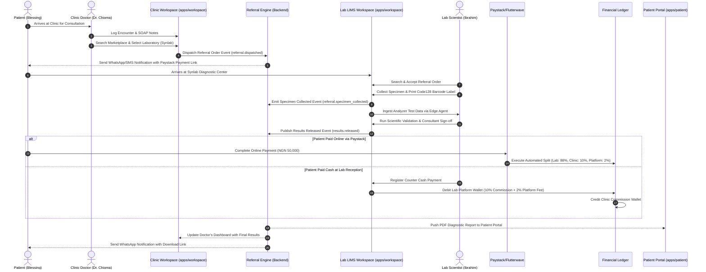

# Curexal V2 Business Workflows & User Journey Maps

This document outlines the end-to-end user journeys connecting patients, outpatient clinics, diagnostic laboratories, imaging centers, retail pharmacies, and financial clearing engines.

---

## 1. Master End-to-End Referral & Care Journey Map

---

## 2. Granular Journey Step Definitions

### Journey Step 1: Patient Registration & Encounter Initialization
1. Patient arrives at outpatient clinic. Frontdesk staff searches Master Patient Index (MPI) by name and phone number.
2. If match found, existing profile is linked. If new, patient profile is generated with E.164 validated phone number.
3. Clinician starts Encounter, logs vitals, enters Subjective/Objective findings, selects ICD-10 diagnosis.

### Journey Step 2: Marketplace Search & Referral Order Dispatch
1. Clinician determines a diagnostic test (e.g., Full Blood Count, Lipid Profile, Liver Function) is required.
2. Clinician opens Referral Marketplace panel:
   - System filters nearby registered laboratories by turnaround time, pricing catalog, and reputation rating.
3. Clinician selects target laboratory (`Synlab Victoria Island`).
4. System generates referral payload containing test parameters, clinical summary, and signature.
5. Referral Engine dispatches `referral.dispatched` NATS event.
6. Notification Engine sends SMS/WhatsApp alert to patient with direct payment checkout link.

### Journey Step 3: Laboratory Specimen Intake & Barcode Printing
1. Patient arrives at laboratory reception or presents digital referral QR code on phone.
2. Lab receptionist/phlebotomist accepts referral in Laboratory Inbox.
3. Phlebotomist logs specimen collection container type (e.g., EDTA K3 tube).
4. System triggers local thermal barcode printer (Code128 format). Phlebotomist attaches label to tube.
5. Specimen is routed to testing bench.

### Journey Step 4: Analyzer Ingestion & Result Validation
1. Automated analyzer (e.g., Sysmex XN-550) processes sample and transmits raw output via serial RS-232 port.
2. **Curexal Edge Agent** captures ASTM output string, validates barcode match, and posts payload to laboratory workspace.
3. Lab Scientist verifies results against reference ranges and delta checks.
4. Consultant Pathologist performs dual-authorization sign-off.
5. System renders official PDF report and publishes `results.released` event.

### Journey Step 5: B2B Settlement & Financial Ledger Execution
1. Financial Ledger intercepts order completion:
   - Evaluates fee split matrix configured for the B2B relationship.
   - For cash payments registered at counter, system executes double-entry journal entry:
     - `Debit`: Performing Lab Platform Wallet
     - `Credit`: Referring Clinic Commission Wallet
     - `Credit`: Curexal Platform Vault Fee
2. Clinic Manager clicks "Withdraw Commission" to trigger Paystack automated bank transfer to clinic account.

### Journey Step 6: Patient Delivery & Prescriptive Follow-up
1. Patient receives instant WhatsApp message: *"Your diagnostic test result from Synlab is ready. View report: [Link]"*.
2. Referring clinician's dashboard automatically updates with green indicator badge: *"Results Received for Patient Blessing"*.
3. Clinician reviews report, generates E-prescription, and routes to patient's preferred pharmacy for dispensing.
