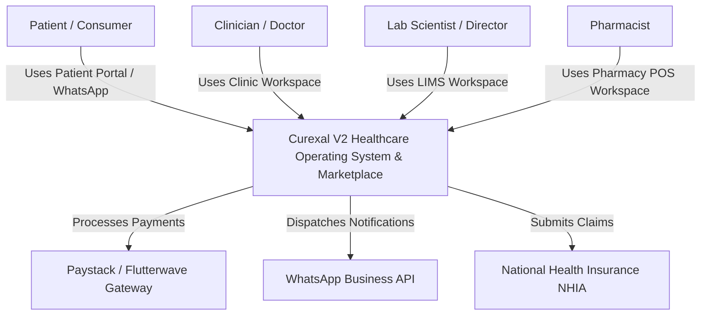
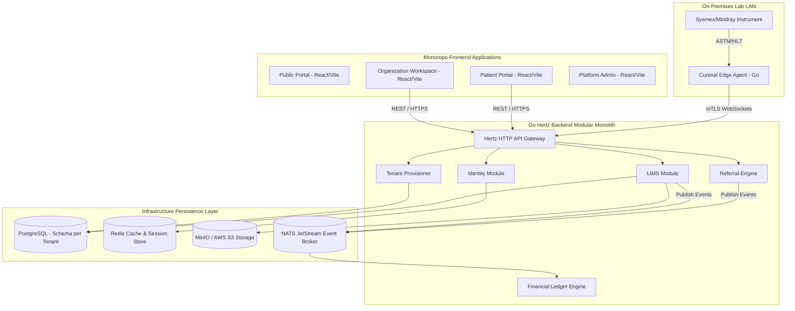
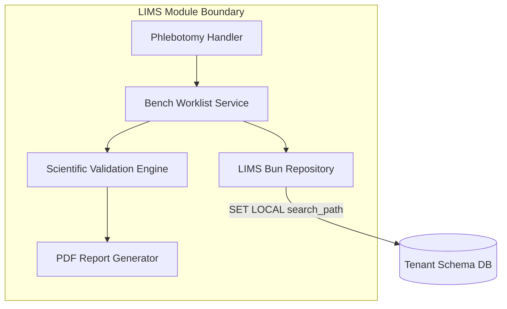

# Curexal V2 C4 Architectural Model

This document defines the C4 Model diagrams (System Context, Containers, and Components) for Curexal V2.

---

## Level 1: System Context Diagram

---

## Level 2: Container Diagram

---

## Level 3: Component Diagram (Laboratory LIMS Module)

