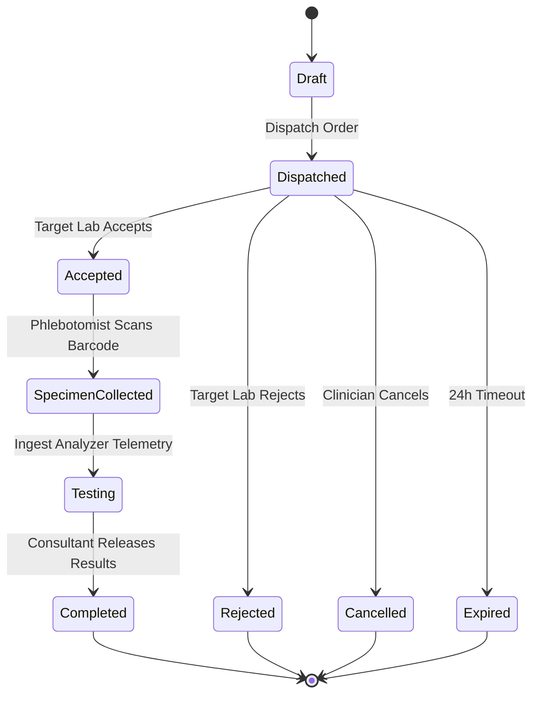
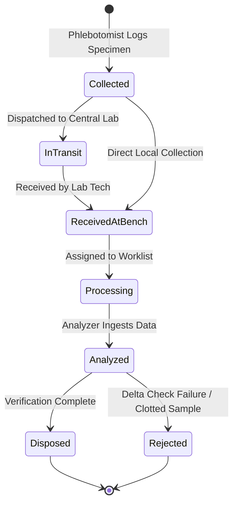
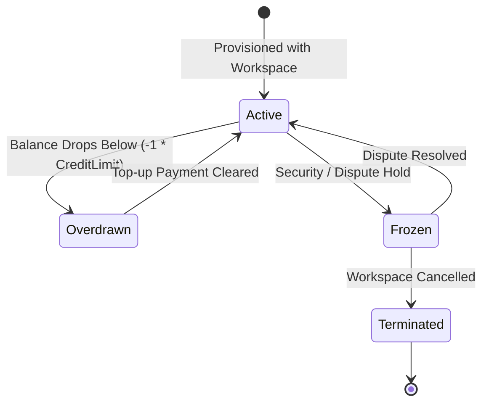

# Curexal V2 Domain State Machine Specifications

This document defines the formal state machines and valid transitions for key domain entities in Curexal V2.

---

## 1. Referral Order State Machine

---

## 2. Specimen State Machine

---

## 3. Financial Wallet State Machine

