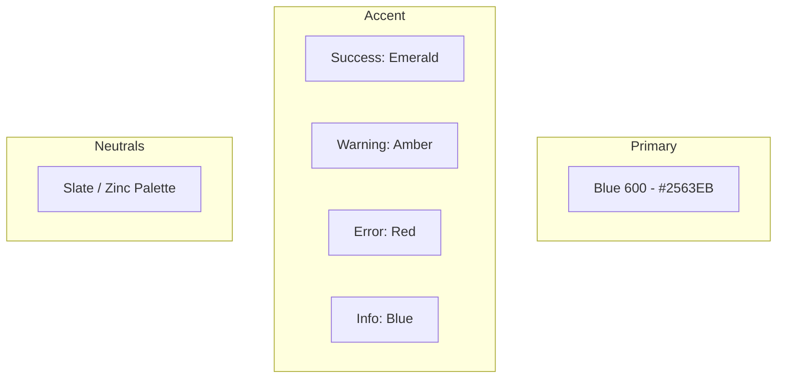

# Curexal Enterprise Design System

This document establishes the official Design System and User Interface standards for Curexal. All frontend applications (Public Portal, Organization Workspace, Patient Portal, and Platform Admin) must strictly conform to these patterns, tokens, and rules to ensure a premium, unified, and consistent user experience.

---

## 1. Design Philosophy

Curexal's interface is modeled after industry-leading, high-fidelity developer dashboards and enterprise platforms (e.g., Stripe, Linear, Notion, Vercel, Paystack, and Ramp). The visual language is defined by the following core tenets:

*   **Professional & Calm:** Utilizes a muted neutral palette so that focus remains on critical data and actions.
*   **Minimal & Intentional:** Every element must serve a functional purpose. Whitespace is treated as a core design feature to prevent cognitive overload.
*   **Enterprise-Grade & Fast:** Built for heavy diagnostic, laboratory, and clinical workflows. Interaction states must feel instant, snappy, and predictable.
*   **Premium Quality:** Achieved through pixel-perfect alignment, consistent borders, soft shadows, and subtle micro-animations.

### Visual Anti-Patterns (What to Avoid)
*   ❌ **Dashboard Templates:** Avoid generic bootstrap-style cards, harsh colored containers, and cluttered page layouts.
*   ❌ **Material Design Over-reliance:** Do not use floating action buttons, heavily rounded pill fields, or flat primary colors.
*   ❌ **Bright / Clashing Gradients:** Avoid neon gradients or decorative backgrounds. Colors must remain functional.
*   ❌ **Crowded Layouts:** Avoid putting too many inputs, tabs, or panels onto one screen without deliberate structural spacing.

---

## 2. Typography

We use typography to establish a clean hierarchical layout.

### Font Families
*   **Primary Font:** `Inter` (imported via Google Fonts)
*   **Fallback Font:** `system-ui, -apple-system, BlinkMacSystemFont, "Segoe UI", Roboto, Helvetica, Arial, sans-serif`

### Typography Hierarchy

| Style / Element | Size (px / rem) | Line Height | Weight | Tailwind Class | Usage Guidelines |
| :--- | :--- | :--- | :--- | :--- | :--- |
| **Dashboard Title** | 36px / 2.25rem | 2.5rem | 700 Bold | `text-4xl font-bold tracking-tight` | Analytics and main dashboard landing headers. |
| **Page Heading** | 30px / 1.875rem | 2.25rem | 700 Bold | `text-3xl font-bold tracking-tight` | Root-level module titles (e.g., LIS reception, CRM). |
| **Section Heading** | 24px / 1.5rem | 2rem | 600 SemiBold | `text-2xl font-semibold` | Division headers within a page or card collections. |
| **Small Heading** | 20px / 1.25rem | 1.75rem | 600 SemiBold | `text-xl font-semibold` | Modals, major card headers, or panel groups. |
| **Large Body** | 18px / 1.125rem | 1.75rem | 500 Medium | `text-lg font-medium` | Lead paragraphs, key stat descriptions. |
| **Body (Default)** | 16px / 1rem | 1.5rem | 400 Regular | `text-base` | Default text, inputs, lists, general paragraphs. |
| **Small Text** | 14px / 0.875rem | 1.25rem | 500 Medium | `text-sm font-medium` | Table cells, labels, button labels, sidebar menus. |
| **Caption** | 12px / 0.75rem | 1rem | 400 Regular | `text-xs` | Helper text, secondary timestamps, small badges. |

### Font Weights
*   `400` (Regular / `font-normal`)
*   `500` (Medium / `font-medium`)
*   `600` (SemiBold / `font-semibold`)
*   `700` (Bold / `font-bold`)

> [!IMPORTANT]
> **Typography Budget Rule:** Never use more than **four** different font sizes on a single screen viewport. Using too many sizes disrupts the vertical scanning rhythm.

---

## 3. Color System

Curexal uses a curated, accessible color palette. Colors must communicate state, actions, and priority, rather than serve as plain decorations.

### 3.1 Core Palette



#### Primary Brand Color
*   **Blue 600 (`#2563EB` / `bg-blue-600`):** Used strictly for primary call-to-actions, active navigation markers, toggles, text links, and interactive states.

#### State Accents
*   **Success / Completed / Paid:** Emerald (`#10B981` / `bg-emerald-500` / `text-emerald-700`)
*   **Warning / Pending / Draft:** Amber (`#F59E0B` / `bg-amber-500` / `text-amber-700`)
*   **Error / Danger / Alert:** Red (`#EF4444` / `bg-red-600` / `text-red-700`)
*   **Info / Neutral Badge:** Blue (`#3B82F6` / `bg-blue-500` / `text-blue-700`) or Slate.

#### Neutral Palette
We utilize a balanced slate/zinc palette for surfaces, borders, and main body text to emphasize clean, dark-mode-friendly or light-mode-friendly corporate aesthetics.
*   **Background (Canvas):** `#F8FAFC` (Slate 50) / `#FFFFFF`
*   **Surface (Card / Panels):** `#FFFFFF`
*   **Text (Primary):** `#0F172A` (Slate 900)
*   **Text (Secondary):** `#475569` (Slate 600)
*   **Text (Placeholder / Muted):** `#94A3B8` (Slate 400)
*   **Borders / Dividers:** `#E2E8F0` (Slate 200)

---

## 4. Spacing Scale

To maintain a rigid visual rhythm, all elements, margins, paddings, and flex/grid gaps must align to the standard **8-point spacing scale**.

| Space Value (px) | Tailwind Equiv. | Common Layout Uses |
| :--- | :--- | :--- |
| **4px** | `1` / `0.25rem` | Between label and input, badge padding, close buttons. |
| **8px** | `2` / `0.5rem` | Small gaps, padding inside list items, table cell vertical padding. |
| **12px** | `3` / `0.75rem` | Badge horizontal padding, compact card padding. |
| **16px** | `4` / `1rem` | Standard padding for lists, list gaps, default input padding. |
| **20px** | `5` / `1.25rem` | Medium component padding, alert box padding. |
| **24px** | `6` / `1.5rem` | Component-level layouts, default card padding, modal body padding. |
| **32px** | `8` / `2rem` | Standard page canvas padding, sections spacing. |
| **40px** | `10` / `2.5rem` | Form groups, structural layout gaps. |
| **48px** | `12` / `3rem` | Large section divisions, modal outer margin. |
| **64px** | `16` / `4rem` | Hero sections layout spacing, empty state container heights. |
| **96px** | `24` / `6rem` | Maximum landing page spacing, massive block offsets. |

> [!WARNING]
> Do not invent arbitrary spacing values (e.g., `13px`, `19px`, `7px`). If it is not on the 8-point scale, it is invalid.

---

## 5. Border Radius & Shadows

Curexal utilizes a modern, clean geometry. Corners are rounded, but never cartoonish.

### Border Radius Tokens
*   **Cards:** `12px` (`rounded-xl` / `0.75rem`)
*   **Dialogs / Modals:** `16px` (`rounded-2xl` / `1rem`)
*   **Inputs / Form Fields:** `10px` (Custom Tailwind config: `rounded-[10px]`)
*   **Buttons:** `10px` (Custom Tailwind config: `rounded-[10px]`)
*   **Badges / Indicators:** `9999px` (`rounded-full`)

### Shadow System
We prefer soft, low-contrast shadows that ground components onto the canvas. Heavy drop shadows or saturated ambient shadows are forbidden.
*   **Subtle Elevation (Cards):** `0 1px 3px 0 rgba(0, 0, 0, 0.05), 0 1px 2px -1px rgba(0, 0, 0, 0.05)`
*   **Medium Elevation (Dropdowns, Popovers):** `0 4px 6px -1px rgba(0, 0, 0, 0.08), 0 2px 4px -2px rgba(0, 0, 0, 0.08)`
*   **High Elevation (Modals, Dialogs):** `0 20px 25px -5px rgba(0, 0, 0, 0.1), 0 8px 10px -6px rgba(0, 0, 0, 0.1)`

---

## 6. Layout & Grid

### Page Canvas Layout
*   **Maximum Content Width:** `1440px` (`max-w-[1440px]`)
*   **Standard Page Outer Padding:** `32px` (`p-8`)
*   **Gutters:** Responsive grid layouts must use `24px` (`gap-6`) or `32px` (`gap-8`) spacing.
*   **Alignment:** Dashboard views must be centered horizontally on larger screens. Never allow text or interactive blocks to stretch edge-to-edge.

```
+-------------------------------------------------------------+
|  1440px Max Width Grid Container (Centered)                 |
|  +-------------------------------------------------------+  |
|  | Sidebar (280px) | Content Area                        |  |
|  |                 | Padding: 32px (p-8)                 |  |
|  |                 |                                     |  |
|  |                 | 12-Column Grid Area (gap-6)         |  |
|  |                 | [Card] [Card] [Card]                |  |
|  +-------------------------------------------------------+  |
+-------------------------------------------------------------+
```

### Grid System
*   Utilize a **12-column grid layout** (`grid grid-cols-12`) for aligning complex forms, metrics cards, and list split views.
*   **Metrics Row:** Typically 3 or 4 columns (`col-span-4` or `col-span-3`).
*   **Split Workspaces:** Two-column split layouts should use a `col-span-8` (main workflow table) and `col-span-4` (details panel) configuration.

---

## 7. Component Library Guidelines

Every component must support standard states and follow accessible, reusable properties.

### 7.1 Form Controls

#### Button
*   **Primary Button:** Solid Blue 600 text overlayed on white. Hover transitions to Blue 700. Focus rings are offset.
*   **Secondary Button:** Clean white bg, Slate 200 border, Slate 700 text. Hover switches to Slate 50.
*   **Danger Button:** Solid Red 600 bg. Hover transitions to Red 700.
*   **Ghost Button:** Transparent background, Slate 700 text. Hover switches to Slate 100 background.
*   *Required States:* Default, Hover, Active, Focus, Loading (with disabled interaction & inline spinner), and Disabled.

#### Input / Textarea
*   Height must remain consistent (`40px` / `h-10`).
*   Border should be Slate 200. Focus state uses a `ring-2 ring-blue-500` with Slate 200 border.
*   Helper text should display in Slate 500 (`text-xs`).
*   *Rule:* Always include a clear visual label and helper text. Never rely on input placeholders alone for context. Required fields must exhibit a red star `*` beside the label.

#### Checkbox, Radio & Switch
*   Must utilize the brand Blue 600 when selected/checked.
*   Active bounds should be accessible via keyboard (use visible focus rings).
*   Switch component must have smooth horizontal sliding transitions (150ms).

#### Select & Combobox
*   Drop-down panels must render below the trigger with a Slate 200 border, rounded corners (12px), and a soft shadow.
*   Options should show a clear Slate 50 hover background. Active options should be marked with a check icon.

---

### 7.2 Feedback & Overlay Controls

#### Command Palette
*   Must be ready for keyboard invocation (`Cmd+K` or `Ctrl+K`).
*   Includes fuzzy-search, group headers, and keyboard navigation support (Up/Down arrow highlight, Enter key to select).

#### Modals & Drawers
*   **Modal Dialog:** Rounded borders (16px), centered on screen with backdrop overlay (`bg-slate-900/40 backdrop-blur-sm`).
*   **Drawer:** Slides smoothly from the right edge. Suitable for contextual detail panels (e.g., patient logs, audit logs).

#### Toasts, Alerts & Tooltips
*   **Alerts:** Flat block styles with left border matching the state color (Red border for error, Emerald border for success).
*   **Toasts:** Automatically auto-dismisses after 4000ms. Displays in top-right or bottom-right coordinates.

---

### 7.3 Data & Navigation Controls

#### Tables & Data Grids
*   **Headers:** Sticky positioning, Slate 50 background, Slate 500 bold text.
*   **Rows:** Alternating subtle backgrounds or light dividers. Highlight rows with a soft hover background (`hover:bg-slate-50/80`).
*   **Sorting:** Visual indicator arrows (Up/Down) next to sortable columns.
*   **State Blocks:** Must handle Empty (No data matches filters), Loading (Skeleton screen cells), and Error states gracefully.

#### Sidebar Navigation
*   Fixed width (`280px`). Simple layout with Lucide icons (20px) next to labels.
*   Active state uses a subtle background block (`bg-slate-100` or `bg-blue-50` with `text-blue-600`).
*   Must support collapsible transitions.

---

## 8. Required UI States

Every feature screen or interactive component list must handle the following six UI states:

```
+---------------------------------------------------------------------------------------------------------------------------------------------------------------------------------------------------------------------------------------------------------------------------------------------------------------------------------------+
| STATE                      | DESIGN IMPLEMENTATION REQUIREMENTS                                                                                                                                                                                                                                                                       |
|----------------------------|----------------------------------------------------------------------------------------------------------------------------------------------------------------------------------------------------------------------------------------------------------------------------------------------------------|
| **1. Loading State**       | Use clean layout skeletons instead of simple global loading bars. Shimmer animations must be light and match the block layout geometry perfectly.                                                                                                                                                       |
| **2. Empty State**         | Display when a database query or folder contains no items. Must include a descriptive Lucide icon (slate color), a brief heading, description text, and a primary CTA button to create the first record.                                                                                                 |
| **3. Error State**         | Display when an API call fails. Incorporates an error label, description, diagnostic details matching RFC7807 problem standards, and a "Retry Action" button.                                                                                                                                            |
| **4. Success State**       | Displays upon transaction completion. Uses subtle green checkmarks, detailed status information, and clear next steps (e.g., "Go to Receipt", "Print Label").                                                                                                                                           |
| **5. Permission Denied**   | Rendered when roles/permissions block action. Standard layout features a locked shield or lock icon, a security alert block, and a link to request workspace privileges from system administrators.                                                                                                      |
| **6. Not Found**           | Standard 404 block for missing data entities. Direct links back to the user's dashboard home are required.                                                                                                                                                                                               |
+---------------------------------------------------------------------------------------------------------------------------------------------------------------------------------------------------------------------------------------------------------------------------------------------------------------------------------------+
```

---

## 9. Icon Rules

Curexal relies exclusively on the **Lucide Icons** library. Mixing icon sets (e.g., FontAwesome, Heroicons, Material Icons) is strictly prohibited to preserve line weight and visual consistency.

*   **Size Standards:**
    *   `16px` (`size-4`): Used for inline icons (inside buttons, input prefixes, badges, inline text).
    *   `20px` (`size-5`): Standard for table rows, sidebar menu links, and subheadings.
    *   `24px` (`size-6`): Reserved for primary page titles, cards, and empty state illustrations.
*   **Color Rules:**
    *   Muted indicators use Slate 400.
    *   Active items mirror their text color (e.g., `text-blue-600`).

---

## 10. Animations & Transitions

Keep transitions subtle, functional, and fast. Flashy or bouncing animations are disallowed.

*   **Duration Scale:** `150ms` (standard interactions, tooltips) to `250ms` (modals, drawers).
*   **Allowed Transition Types:**
    *   `fade` (`opacity-0` -> `opacity-100`)
    *   `slide` (drawers sliding in from off-screen, accordions expanding vertically)
    *   `scale` (modals scaling up slightly from `95%` -> `100%` on arrival)
*   **Timing Functions:** Easing functions must use `cubic-bezier(0.4, 0, 0.2, 1)` (standard ease-in-out).

---

## 11. Accessibility (WCAG AA)

*   **Color Contrast:** Text-to-background contrast ratio must satisfy WCAG AA standards (minimum 4.5:1 for body text, 3:1 for large headers).
*   **Visible Focus:** Do not hide focus rings. Interactive components must output high-visibility focus borders (`focus-visible:ring-2 focus-visible:ring-blue-500 focus-visible:ring-offset-2`).
*   **ARIA attributes:** Form fields must have corresponding labels or `aria-label` tags. Modals must specify `role="dialog"` and manage focus traps.
*   **Keyboard Support:** All modals must close with the `Escape` key. Select boxes, comboboxes, and menu dropdowns must be navigate-ready using arrow keys.

---

## 12. Responsive Breakpoints

We adopt a desktop-first design priority, meaning layout composition starts on large screens, and content wraps naturally downward to mobile displays.

*   **Desktop (default):** Layout is optimized for `1440px` down to `1280px` (standard desktop screen sizes).
*   **Laptop (`lg` / `1024px`):** Sidebars collapse into floating buttons, margins reduce to `24px`.
*   **Tablet (`md` / `768px`):** Layout transitions to single columns, grids wrap, standard padding drops to `16px`.
*   **Mobile (`sm` / `640px`):** Headers stacked vertically, compact lists replace tables, inputs fill entire screen widths.

---

## 13. Application Implementation Rules

### Shared Standards
The four Curexal monorepo applications:
1.  **Public Portal**
2.  **Organization Workspace**
3.  **Patient Portal**
4.  **Platform Admin**

Must strictly share the tailwind theme values. Under no circumstances should an individual app write custom color codes (e.g., `#ff4500` or `#32cd32`) inside components. Use the design system tokens.

### Development Stack Restrictions
*   **Framework:** React with TypeScript.
*   **CSS Engine:** Tailwind CSS.
*   **Foundational Library:** `shadcn/ui` components (buttons, input, dialogue primitives) modified to default to Curexal's border-radius (`10px`/`12px`) and color themes.
*   **Data Flow:** `TanStack Query` for caching/fetching states, and `React Hook Form` for forms validation.
